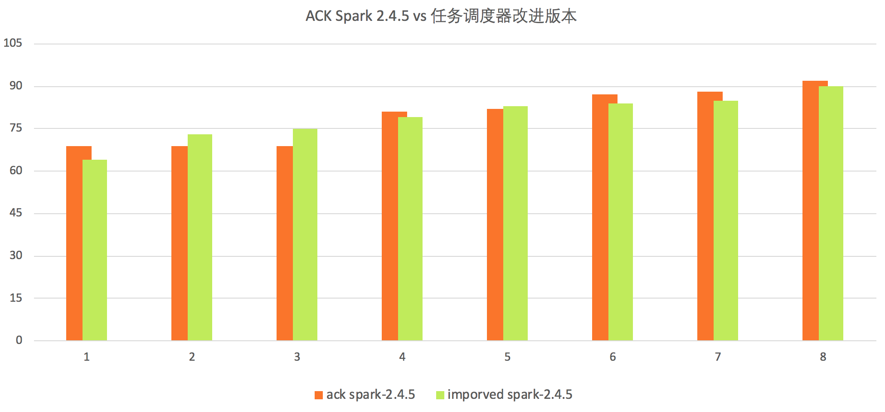

## How to use it
### Preparing
#### Make the tpcds application
1) add the jars in lib/ as lib of your project.
2) run sbt assembly, and get target/scala-2.11/SparkExampleScala-assembly-0.1.jar .
```bash
sbt assembly
```

#### Make the tpcds-kit
tpcds-kit is needed to generate the dataSet for tpc-ds benchmark
```bash
git clone https://github.com/davies/tpcds-kit.git
yum install gcc gcc-c++ bison flex cmake ncurses-devel
cd tpcds-kit/tools
cp Makefile.suite Makefile # Makefile.suite as Makefile
make
#check
./dsqgen --help
```


#### Build the application docker image
Dockerfile
```
FROM registry.cn-hangzhou.aliyuncs.com/acs/spark:ack-2.4.5-f757ab6
RUN rm $SPARK_HOME/jars/kubernetes-client-*.jar
ADD https://repo1.maven.org/maven2/io/fabric8/kubernetes-client/4.4.2/kubernetes-client-4.4.2.jar $SPARK_HOME/jars
RUN mkdir -p /opt/spark/jars
RUN mkdir -p /tmp/tpcds-kit/tools
COPY SparkExampleScala-assembly-0.1.jar /opt/spark/jars
COPY tools/ /tmp/tpcds-kit/tools

```
then, tag the image as your own and push to any image registry.

### Submit to kubernetes cluster
```bash
#submit generate data
kubectl create -f tpcds-operator-data-generator.yaml --kubeconfig= ${your kubeconfig}

# wait for the dataSet is ready
# submit query benchmark
kubectl create -f tpcds-operator-query-runner.yaml --kubeconfig=${your kubeconfig}

#some params in thses files need to be changed to your own env
```

## BenchMark Result on Aliyun Kubernetes
The dataSet is 1000GB, when we try to increase the cluster executor pods:


then, we modified the parallelism of query:


we also show the detail of each batches:

parallelism:8


parallelism:18


parallelism:35


All the query can be finished in 38 minutes with 200 X 8C32G kubernetes executor pods. 


